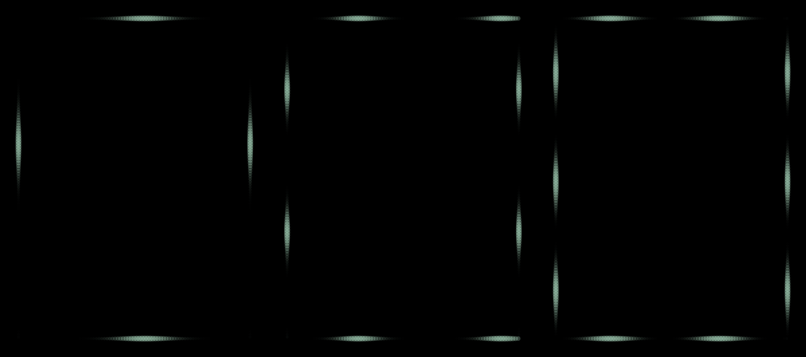
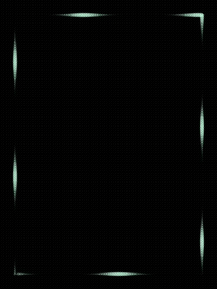

# Otolith

**English** | [中文](README.zh-CN.md)

> ⚠️ **Passengers only.** This app paints an animated light band across the whole display.
> It is **not for drivers** — do not use it while driving, riding, or operating machinery.
> Its whole purpose is to give a *passenger* a motion reference.

Motion-sickness relief for **Rokid Glasses**: a visual reference that moves the way your body
actually feels. Inspired by iPhone's *Vehicle Motion Cues*.

When you ride in a car your inner ear feels the acceleration but your eyes see a static world —
that conflict is what makes you sick. Otolith draws a **flowing band of light** along the edge of
the display that drifts **opposite to the measured acceleration**, so the eyes and the inner ear
agree again.

## What it looks like



*Left to right: mild, moderate, severe — the band gets wider and denser with the level.*



*The demo mode walking through a car's timeline: accelerating, cruising, braking, stopping, turning.*


Four edges of the screen are lined with **dense little bulbs**. Their brightness is modulated by a
**travelling wave** — the bright band sweeps along and the bulbs light up one after another and go
dark one after another, so the whole edge reads as a *flowing band of light* (not a few moving dots).

## How the motion is mapped

| Acceleration | Light band |
|---|---|
| Longitudinal (accelerating / braking) | left & right edges flow **down / up** (environment slides backwards) |
| Lateral (turning) | top & bottom edges flow **left / right** |
| Turning hard | the other axis is **cross-suppressed** (up to −65%) so a turn doesn't feel like "going forward" |

Speed is proportional to the acceleration magnitude (capped), and the flow stops when there is no
acceleration — a constant-velocity ride has no motion cue to give, which is correct.

## Levels

Tap the touchpad to cycle **轻 (mild) → 中 (moderate) → 重 (severe)**. One level changes both the
band width and the screen brightness:

| Level | Wavelength / sharpness | Screen brightness |
|---|---|---|
| 轻 | 300 dp / 6.0 — thin, sparse bands | constant **35 %** |
| 中 | 170 dp / 3.5 | **35 % → 100 %**, rising with acceleration |
| 重 | 130 dp / 1.5 — wide, dense bands | **35 % → 100 %**, rising with acceleration |

Brightness is forced **per window** (`WindowManager.LayoutParams.screenBrightness`) — no permission
needed, it never touches the system brightness setting, and it reverts the moment the app exits.
Full brightness is reached at 2.5 m/s²; the ramp is smoothed with a 0.45 s time constant.

## Controls

| Gesture | Action |
|---|---|
| Tap | cycle level |
| Long press | pause / resume |
| Double tap | exit (needs two presses within 1.5 s) |
| Two-finger swipe | previous / next level (when the firmware delivers it) |

Accidental-touch guards: a tap is de-duplicated over 900 ms (one physical tap emits two key events
on this firmware, and brushing the touchpad emits a burst), and exiting needs a double press.

## Notes from the field (YodaOS-Sprite / RG-glasses)

- **Two-finger swipes are not reliably delivered to third-party apps.** On this firmware they
  sometimes arrive as a broadcast, sometimes as `KEYCODE_DPAD_*`, sometimes not at all. The app
  handles all three, but the interaction is designed so that **taps alone can do everything**.
- A touchpad tap arrives as `KEYCODE_NOTIFICATION` (not `KEYCODE_ENTER`); both are accepted.
- While a phone notification is showing, the assist server steals the input focus, so keys and the
  window-brightness override stop working until it is dismissed.
- A high-frequency flicker (10–24 Hz) is unpleasant and unsafe for photosensitive users, so the
  brightness modulation is a 0.9 Hz "breathing" of ±5 % instead.

## Build

```bash
./gradlew assembleDebug
adb install -r app/build/outputs/apk/debug/app-debug.apk
adb shell am start -n com.takano.rcues/.MainActivity
```

Debug helpers: `--ez demo true` (simulated car timeline), `--ez widthDemo true` (constant flow,
cycles the three levels every 7 s), `--ei severity 0|1|2`.

## Credits

Built by **DeepSeek v4.1-flash** — code, docs, and all on-device verification.

## License

MIT